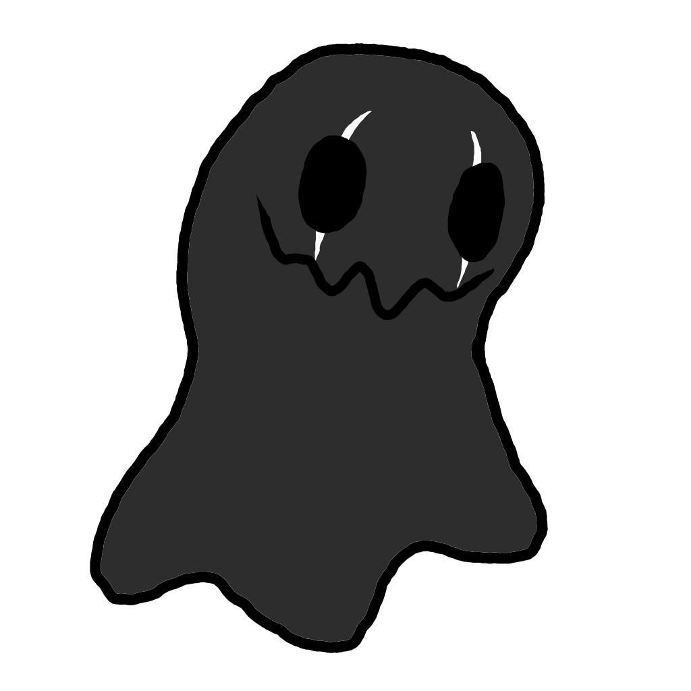
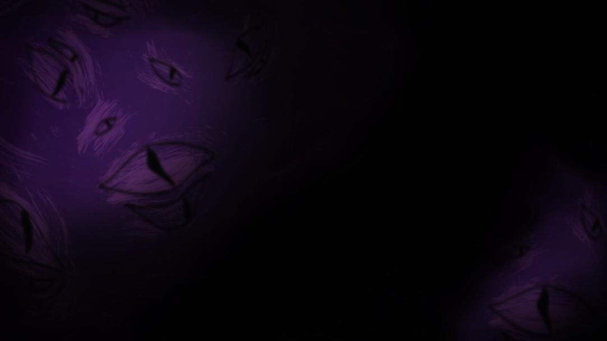
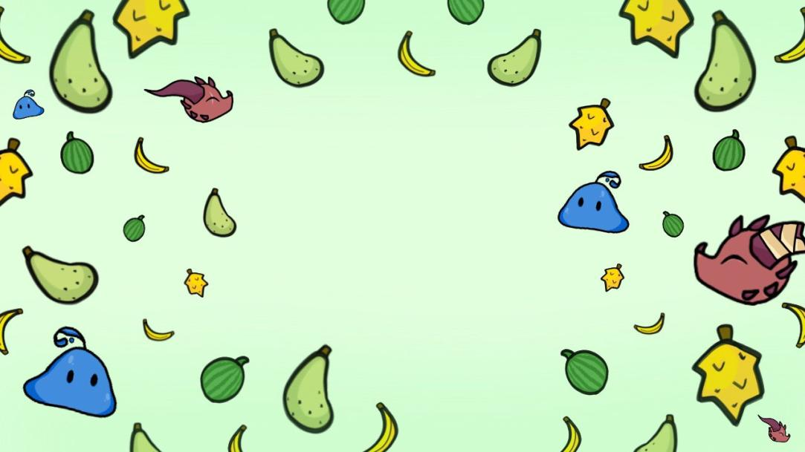
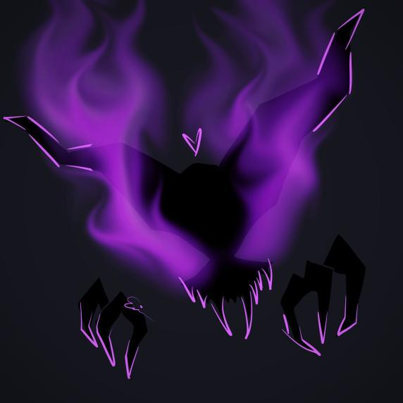
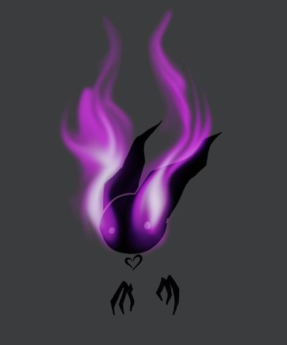
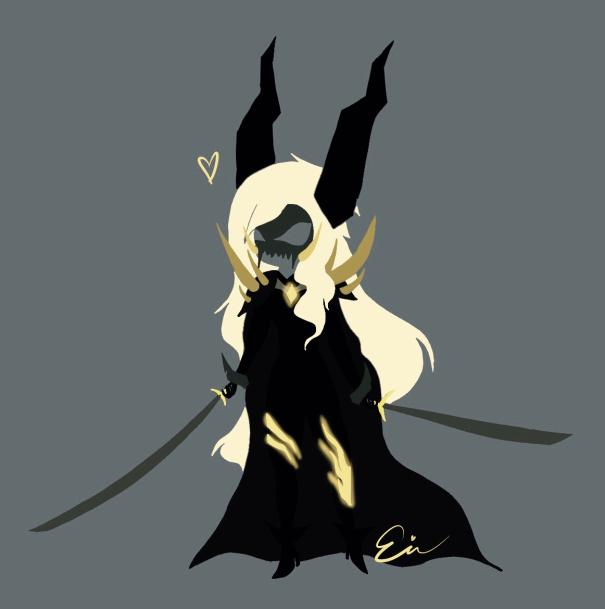
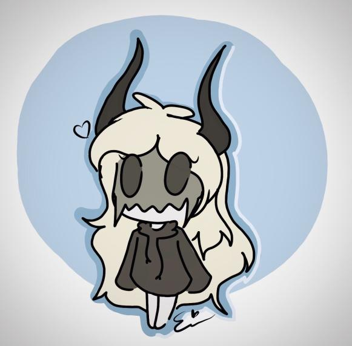

###### Erica Hoots
### This is a personal website with a focus on Erica's artwork and creativity
##### Last Update: 3 July 2022
### For more information, connect with me on LinkedIn!: 

# PLEASE CHECK OUT MY UPDATED PORTFOLIO: <a href="https://ericahoots.com/portfolio/">https://ericahoots.com/portfolio//</a>

## SUMMARY
Creative and meticulous student at George Mason University with experience working with IT/programming scenarios in both the government and private sector through summer internships. Seeking challenging roles in development, web design, and/or UIUX within the space, defense, and/or intelligence sectors.
## EDUCATION
George Mason University  Expected Graduation: December 2022  Information Technology (IT) 
&emsp; Concentration in  Database Technology & Programming

*Overall GPA: 3.98* 

## ARTWORK
#### Projects
Created in-game art as well as character concepts for games: 
**Morg's Mimics (Fall 2020):** <a href="https://gadig.itch.io/morgs-mimics">https://gadig.itch.io/morgs-mimics</a> 

 
**Attack of the Magic Cardboard (Spring 2021):** <a href="https://gadig.itch.io/attack-of-the-magic-cardboard">https://gadig.itch.io/attack-of-the-magic-cardboard</a> 
**Kobold Kwest (Fall 2021):** <a href="https://gadig.itch,io/kobold-kwest">https://gadig.itch.io/kobold-kwest</a> 

 
**One Man Band (Spring 2022):** <a href="https://gadig.itch.io/one-man-band">https://gadig.itch.io/one-man-band</a>

#### Personal Art

## MUSIC
**Ability to read bass and treble clef sheet music** 
+ Continued practice of guitar - not in an ensemble (*2018-Present*) 
+ Introduction to Music Theory course during college (*Spring 2019*) 
+ Member of a classical guitar ensemble during middle and high school (*2013-2018*) 
+ Member of orchestra for cello during middle school (*2011-2012*)

